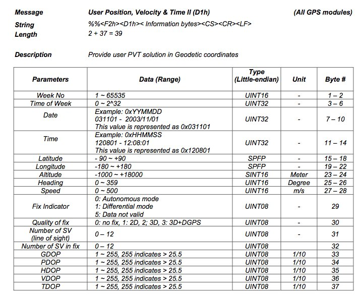
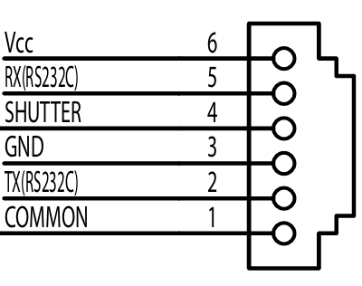
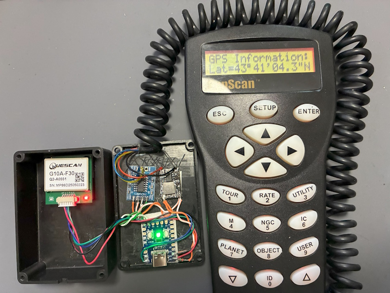

# SynScanGPS
Emulate a SynScan GPS using a Raspberry Pi Pico and a cheap GPS

# Hardware
- RP2040-Zero (the RGB led is used as fix indicator)
- 12v -> 5v convertissor
- RS232/TTL adaptor
- RJ cable to the SynScan (12v & RS232)
- A GPS receiver (no speed issue with this Pico version, configure GPS_BAUD_RATE according your GPS)

Thanks to keymlinux for the latitude/longitude encoding
