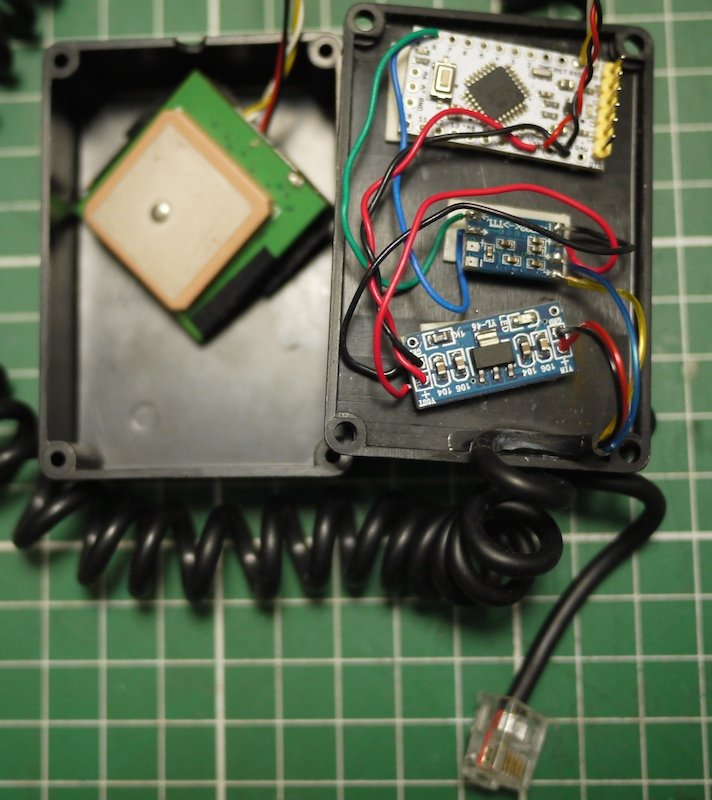

# SynScanGPS

Emulate a SynScan GPS using an Arduino and a cheap GPS

# Hardaware
- Arduino Mini
- 12v -> 5v convertissor
- RS232/TTL adaptor
- RJ cable to the SynScan (12v & RS232)

 

Thanks to keymlinux for the latitude/longitude encoding
